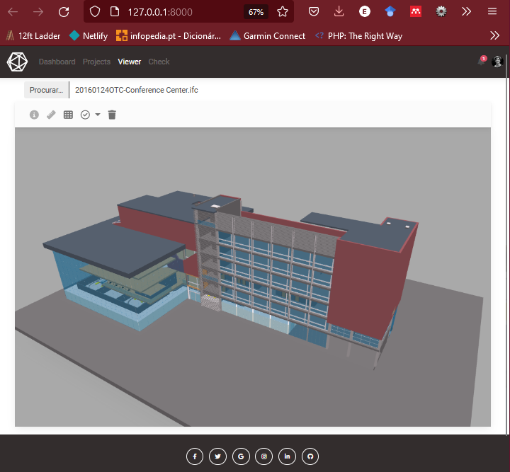
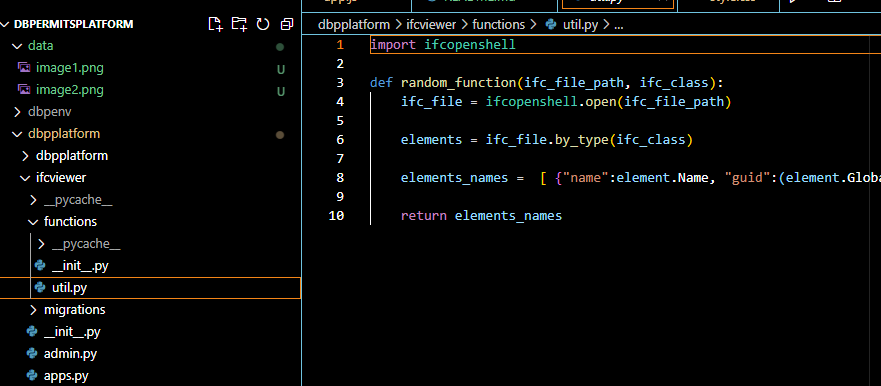
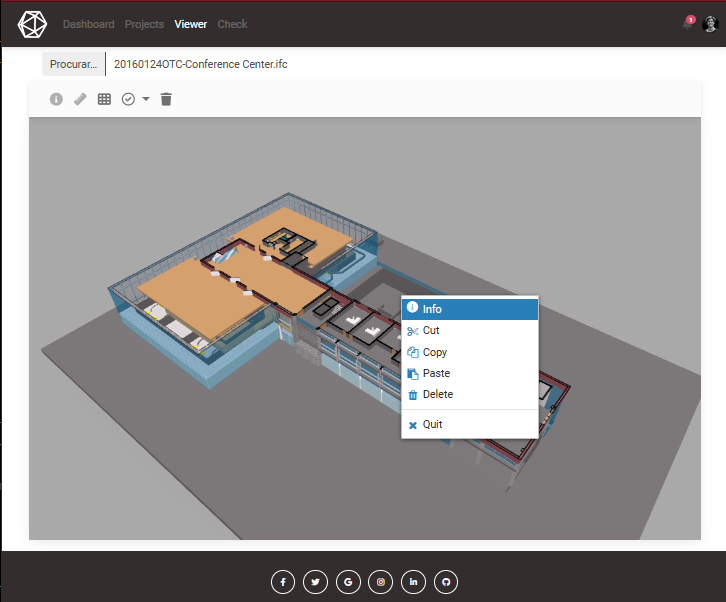

# Plataforma IFC.js + IfcOpenShell

Exemplo de desenvolvimento de plataforma web com integração de tecnologias utilizadas para a análise e visualização de ficheiros IFC.

Tecnologias utilizadas pela plataforma:

- Django: framework web para desenvolvimento back-end baseado em python;
- IFC.js: toolkit BIM, baseado em JavaScript, utilizado para fazer a análise de ficheiros IFC e integrar a visualização de modelos, com processamento no navegador, através do uso da biblioteca Three.js;
- IfcOpenShell: biblioteca Python, para a análise de ficheiros IFC, que permite o processamento de informações no servidor, com integração ao Django. Possui maior documentação e estabilidade, sendo uma ótima forma de se realizar verificações complexas em modelos;
- Bootstrap: framework CSS que permite o desenvolvimento de páginas mais atraentes com facilidade;

## imagens 

A plataforma permite carregar os modelos contidos em ficheiros IFC no navegador, enquanto processa algumas informações em back-end através do IfcOpenShell.

O IfcOpenShell é utilizado para a criação de funções que são importadas para processar informações e gerar novas views com estas informações.

Já existem funções desenvolvidas em JavaScript para integrar a interface desenvolvida com o Bootstrap à ferramentas de visualização do modelo com o IFC.js.

## Autor

[Bruno Muniz](https://github.com/Muniz1994)